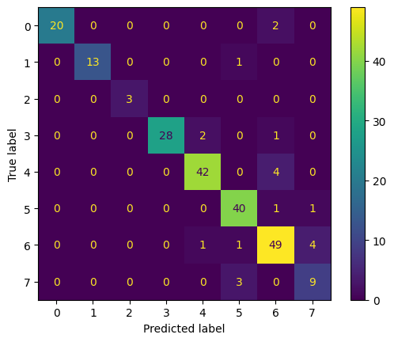
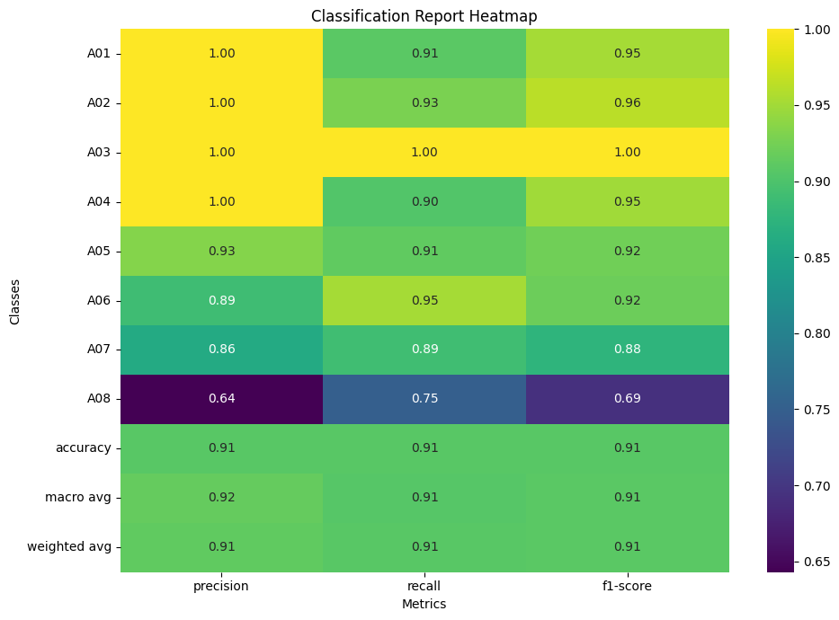
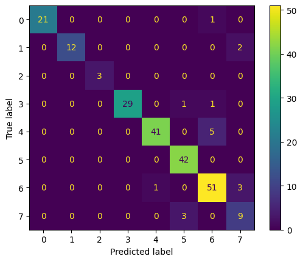
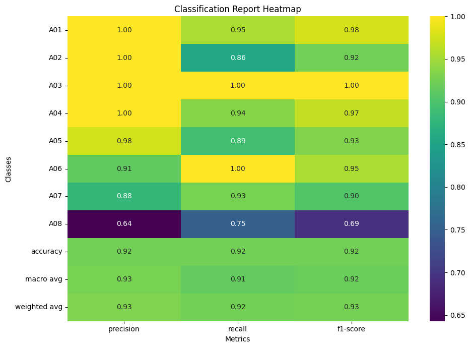
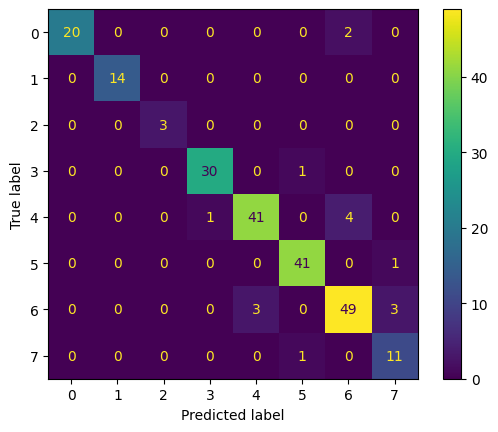
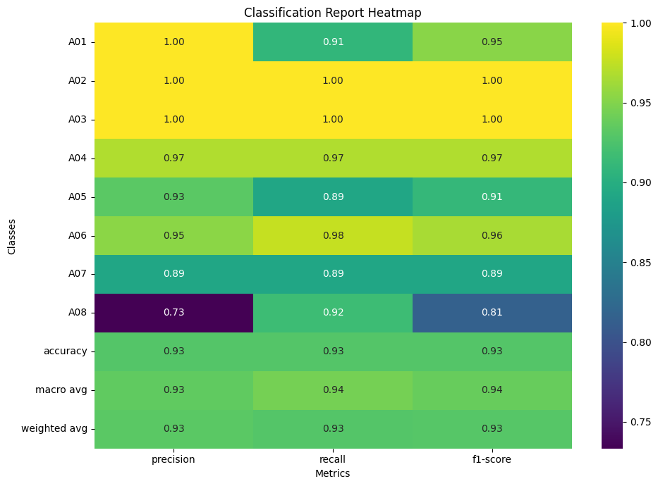
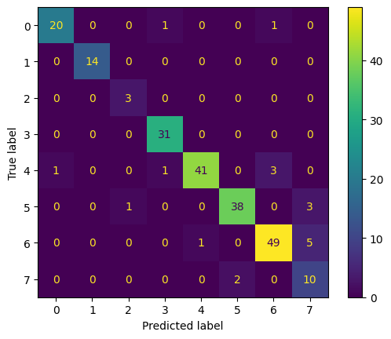
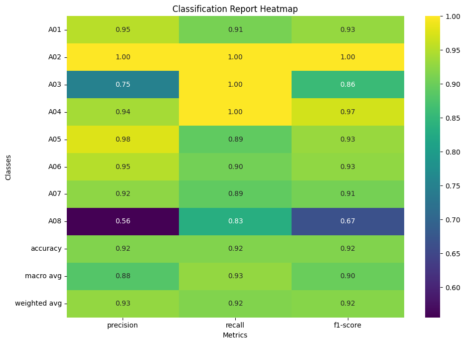

# Analisi delle Prestazioni di Logistic Regression Multi-Classe con Diverse Configurazioni di Feature

Questo repository documenta i risultati di esperimenti condotti utilizzando un modello di Logistic Regression Multi-Classe. L'obiettivo è valutare come le prestazioni del modello variano al cambiare del numero e del tipo di feature estratte, combinando feature di Haralick e Local Binary Patterns (LBP).

## Metodologia

Per l'estrazione delle feature LBP, sono stati variati i parametri `Radius` e `N_points`. Le feature di Haralick utilizzate sono 52 in tutte le configurazioni.

## Risultati Sperimentali

Di seguito sono riportati i risultati ottenuti per diverse combinazioni di feature. Per ogni configurazione, vengono mostrate la matrice di confusione e il classification report.

### Configurazione 1: 62 Feature Totali
-   **Feature Haralick:** 52
-   **Feature LBP:** 10
    -   `Radius = 1`
    -   `N_points = 8`

**Matrice di Confusione:**

**Classification Report:**

### Configurazione 2: 70 Feature Totali
-   **Feature Haralick:** 52
-   **Feature LBP:** 18
    -   `Radius = 2`
    -   `N_points = 16`

**Matrice di Confusione:**

**Classification Report:**

### Configurazione 3: 78 Feature Totali
-   **Feature Haralick:** 52
-   **Feature LBP:** 26
    -   `Radius = 3`
    -   `N_points = 24`

**Matrice di Confusione:**

**Classification Report:**

### Configurazione 4: 86 Feature Totali
-   **Feature Haralick:** 52
-   **Feature LBP:** 34
    -   `Radius = 4`
    -   `N_points = 32`

**Matrice di Confusione:**

**Classification Report:**

## Osservazioni e Conclusioni Preliminari

*(In questa sezione, potresti aggiungere un riassunto delle tue osservazioni. Ad esempio, come cambiano le metriche (accuracy, precision, recall, F1-score) all'aumentare del numero di feature LBP? C'è una configurazione che sembra dare i risultati migliori? Ci sono classi particolarmente difficili da classificare?)*

Esempio:
"Dall'analisi dei risultati, si osserva che l'incremento delle feature LBP porta a [un miglioramento/peggioramento/nessun cambiamento significativo] nelle prestazioni generali del modello. La configurazione con X feature totali (Y Haralick e Z LBP con Radius=A e N_points=B) sembra offrire il miglior compromesso in termini di [specifica metrica, es. F1-score medio]."

## Conclusioni

In questo studio, abbiamo analizzato le prestazioni di un modello di Logistic Regression Multi-Classe con diverse configurazioni di feature. I risultati mostrano che l'aggiunta di feature LBP può migliorare le prestazioni del modello, ma è importante scegliere la configurazione giusta per ottenere i migliori risultati.

## Possibili Sviluppi Futuri

*(Qui potresti elencare idee per ulteriori esperimenti o miglioramenti)*
-   Testare altri algoritmi di classificazione.
-   Esplorare ulteriori variazioni dei parametri LBP o altre tecniche di estrazione feature.
-   Effettuare un'analisi più approfondita degli errori di classificazione.
